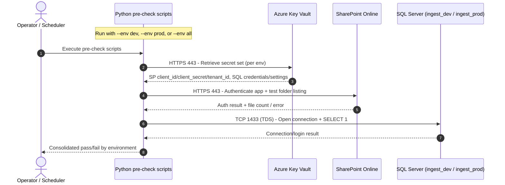
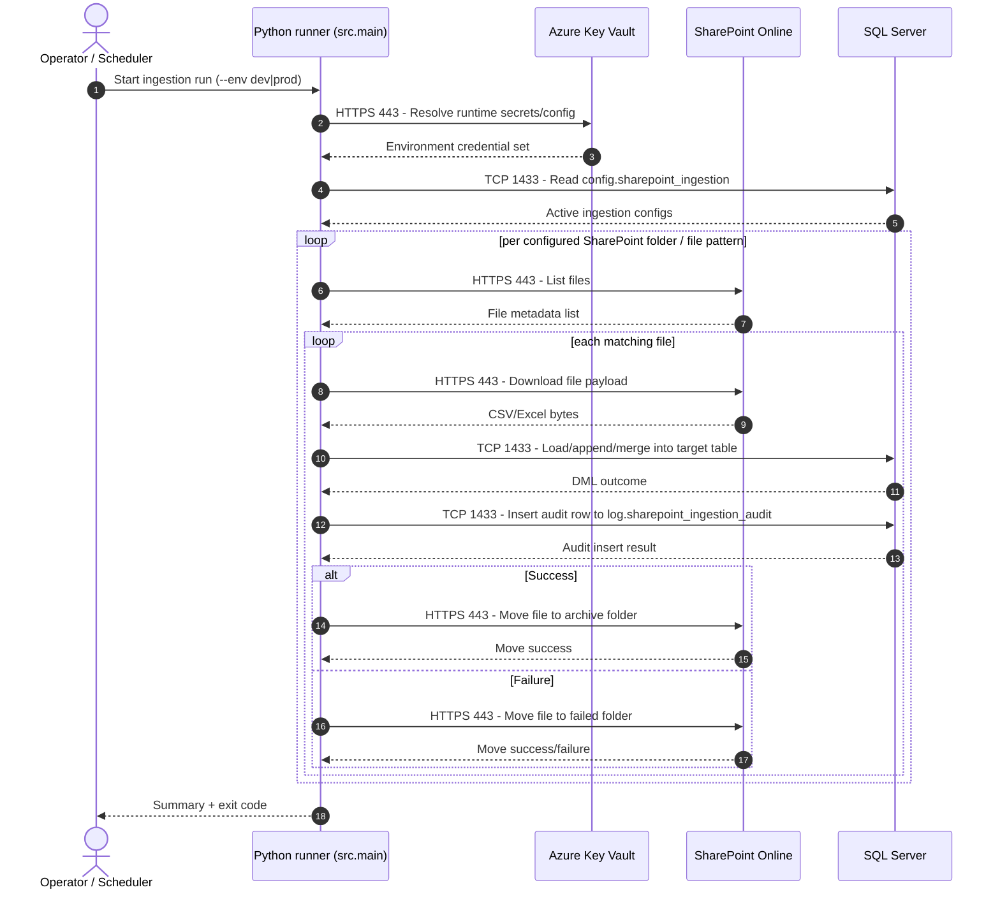

# Sequence Diagram – Python, AKV, SharePoint, and SQL Calls

This sequence focuses on connection/auth call flow and data movement between:

- Python pre-check / ingestion runner
- Azure Key Vault (AKV)
- SharePoint Online
- SQL Server database

## 1) Pre-check sequence (dev/prod or all)

## 2) Ingestion runtime sequence

## Port call matrix

| Source | Destination | Protocol | Port | Call Type |
|---|---|---:|---:|---|
| Python | Azure Key Vault | HTTPS | 443 | Secret retrieval |
| Python | SharePoint Online | HTTPS | 443 | Auth, list, download, move |
| Python | SQL Server | TDS/TCP | 1433 | Config reads, data writes, audit writes |
